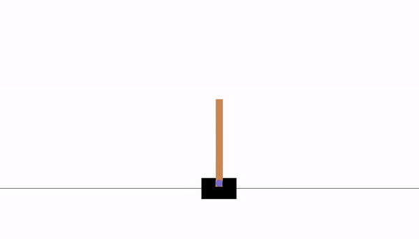

# Self-solving control theory problems with NEAT
This is a brief tutorial to solve some classical control theory problems from the OpenAI Gym environment using the NEAT algorithm.

## Background

### NEAT
NEAT (Neuro-Evolution of Augmenting Topologies) is a popular neuroevolution algorithm, one of the few such algorithms that evolves the architectures of its networks in addition to the weights. For more information, see this research paper: http://nn.cs.utexas.edu/downloads/papers/stanley.ec02.pdf.
A python implementation of NEAT is available with the package python-neat.

### OpenAI Gym
The Gym library is a collection of test problems — environments — that you can use to work out your reinforcement learning algorithms, these environments have a shared interface, allowing you to write general algorithms. It supports teaching agents everything from walking to playing games like Pong or Pinball.

It makes no assumptions about the structure of your agent, and is compatible with any numerical computation library.

## Environments
### CartPole-v1
A pole is attached by an un-actuated joint to a cart, which moves along a frictionless track. The pendulum starts upright, and the goal is to prevent it from falling over by increasing and reducing the cart's velocity.

#### Observations

Type: Box(4)

| ID | Observation | Min | Max |
| ---- | ----------- | ---- | ----| 
| 0 | Cart Position | -2.4 | 2.4 |
| 1 | Cart Velocity | -Inf | Inf |
| 2 | Pole Angle | ~ -41.8° | ~ 41.8°| 
| 3 | Pole Velocity At Tip | -Inf | Inf|

#### Actions

Type: Discrete(2)

| ID |	Action |
| ---- | ----- |
| 0 	| Push cart to the left |
| 1 	| Push cart to the right |

#### Reward
The reward is 1 for every step taken, including the termination step.

#### Starting State
All observations are assigned a uniform random value between ±0.05.

#### Episode Termination
* Pole Angle is more than ±12°
* Cart Position is more than ±2.4 (center of the cart reaches the edge of the display)
* Episode length is greater than 500.

#### Solved Requirements
The task is considered solved when the average reward is greater than or equal to 475.0 over 100 consecutive trials.

#### CartPole-v0
There exists also another version of CartPole namely CartPole-v0, which differs from CartPole-v0 in the solved requirements: 195.0 over 100 consecutive trials instead of 475.0.

#### Solution
This is an animation of the cart-pole controlled by the evolved neural network which solved the environment.

And it's clearly better than the random agent.

