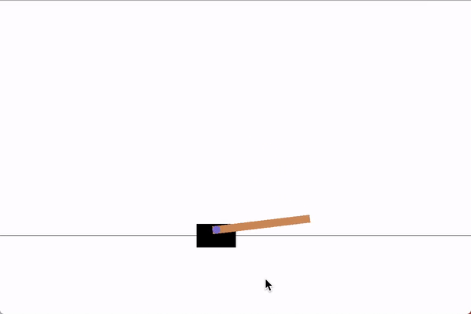

# CartPole-v1
A pole is attached by an un-actuated joint to a cart, which moves along a frictionless track. The pendulum starts upright, and the goal is to prevent it from falling over by increasing and reducing the cart's velocity.

## Observations

Type: Box(4)

| ID | Observation | Min | Max |
| ---- | ----------- | ---- | ----| 
| 0 | Cart Position | -2.4 | 2.4 |
| 1 | Cart Velocity | -Inf | Inf |
| 2 | Pole Angle | ~ -41.8° | ~ 41.8°| 
| 3 | Pole Velocity At Tip | -Inf | Inf|

## Actions

Type: Discrete(2)

| ID |	Action |
| ---- | ----- |
| 0 	| Push cart to the left |
| 1 	| Push cart to the right |

## Reward
The reward is 1 for every step taken, including the termination step.

## Starting State
All observations are assigned a uniform random value between ±0.05.

## Episode Termination
* Pole Angle is more than ±12°
* Cart Position is more than ±2.4 (center of the cart reaches the edge of the display)
* Episode length is greater than 500.

## Solved Requirements
The task is considered solved when the average reward is greater than or equal to 475.0 over 100 consecutive trials.

## CartPole-v0
There exists also another version of CartPole namely CartPole-v0, which differs from CartPole-v0 in the solved requirements: 195.0 over 100 consecutive trials instead of 475.0.

## Example of the solution
This is an animation of the cart-pole controlled by the evolved neural network which solved the environment.

And it's clearly better than the random agent.

