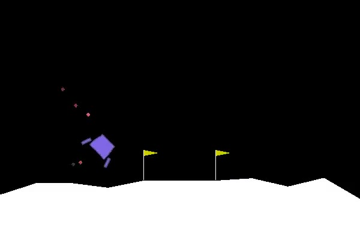

# LunarLander-v2
Rocket trajectory optimization is a classic topic in Optimal Control. 

## Observations

Type: Box(8)

## Actions

Type: Discrete(4)

| ID |	Action |
| ---- | ----- |
| 0 	| Do nothing |
| 1 	| Fire left engine |
| 0 	| Fire main engine |
| 1 	| Fire right engine |

## Reward and episode Termination
Reward for moving from the top of the screen to landing pad and zero speed is about 100 to 140 points. If lander moves away from landing pad it loses reward back. Episode finishes if the lander crashes or comes to rest, receiving additional -100 or +100 points. Each leg ground contact is +10. Firing main engine is -0.3 points each frame. Solved is 200 points. Landing outside landing pad is possible. Fuel is infinite, so an agent can learn to fly and then land on its first attempt. 

## Starting State
Landing pad is always starting at coordinates (0,0).

## Solved Requirements
The task is considered solved when the average reward is greater than or equal to 200.0 over 100 consecutive trials.

## Example of the solution
The tasks takes about 80 generations to be solved.

This is an animation of the lander controlled by the evolved neural network which solved the environment.
